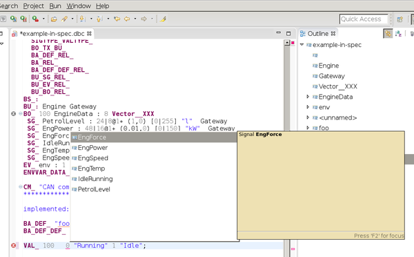

# IDE for DBC file format

EMF Model and IDE for DBC format

Update site
-----------

http://pizzafactory.github.io/CanDbc/p2repo/8.5/

Prequisite
----------

PizzaFactory 8.5 + modeling features

Mayby this works on Eclipse 4.4.2 (Luna) also.
